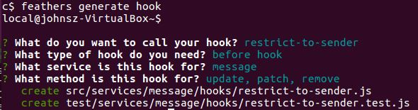
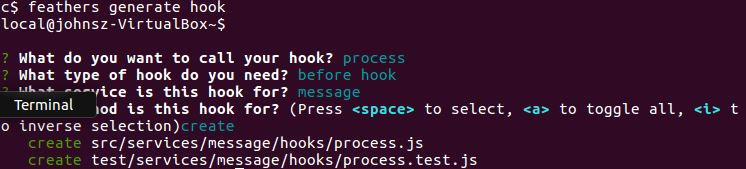

# Finishing the server

We implemented a basic client in the previous section which allows us to exercise the server.
Let's complete that server now.

## Working example

| Source code: [chat/server/finish](https://github.com/eddyystop/feathers-an-introduction/tree/master/examples/chat/server/finish)

| Client code: [chat/server/finish/public/socketio.html](https://github.com/eddyystop/feathers-an-introduction/blob/master/examples/chat/server/finish/public/socketio.html)
and
[chat/server/finish/public/socketio-app.js](https://github.com/eddyystop/feathers-an-introduction/blob/master/examples/chat/server/finish/public/socketio-app.js)

| Start the server: `node ./examples/chat/server/finish/src`

| Point the browser at: `//localhost:3030/socketio.html`

## Completing the server requirements

We'll now complete the remaining server requirements we
[itemized](./readme.md) when we started. They are:
- messages
    - Restrict message posting to signed-in users.
    - Sanitize the messages, e.g. basic HTML escaping.
    - Identify which user created a message and at what time.
    - Allow users to only modify and delete their own messages.

## Add authentication

We could have added authentication to messages back when we
[created the service](./start-server.md#basic-scaffolding).
However this now gives us a chance to manually add the authentication hooks for all methods.

| View complete file 
[chat/server/finish/src/services/message/hooks/index.js](https://github.com/eddyystop/feathers-an-introduction/blob/master/examples/chat/server/finish/src/services/message/hooks/index.js).
View changes from file hooks/1.js:
[Unified](http://htmlpreview.github.io/?https://github.com/eddyystop/feathers-an-introduction/blob/master/examples/chat/_diff/server-finish-message-line.html)
|
[Split](http://htmlpreview.github.io/?https://github.com/eddyystop/feathers-an-introduction/blob/master/examples/chat/_diff/server-finish-message-side.html)

```javascript
// src/services/message/hooks/index.js
exports.before = {
  all: [
    auth.verifyToken(),
    auth.populateUser(),
    auth.restrictToAuthenticated()
  ],
  /// ...
};
```

- `auth.verifyToken` throws if the JSON Token is badly formed.
- `auth.populateUser` copies the client's user item to `hook.params.user`.
- `restrictToAuthenticated` throws if the user is not already authenticated.

## Add authorization

We need a hook which ensures users can only remove, update and patch their own messages. 
```text
mkdir examples/chat/server/finish
cd examples/chat/server/finish
```


Then copy the following hook:

```javascript
// src/services/message/hooks/restrict-to-sender.js
const errors = require('feathers-errors');

module.exports = function(options) {
  return function(hook) {
    const messageService = hook.app.service('messages');
    
    // First get the message that the user wants to access
    return messageService.get(hook.id, hook.params).then(message => {
      // Throw a not authenticated error if the message and user id don't match
      if (message.sentBy._id !== hook.params.user._id && hook.provider) {
        throw new errors.NotAuthenticated('Access not allowed');
      }
      
      // Otherwise just return the hook
      return hook;
    });
  };
};
```

- `hook.app` - Hooks conveniently get the `app` object.
- `hook.app.service()` - With `app`, hooks can get a handle to any service.
- The update, patch and remove service calls do not necessarily provide us
with the data we know who created the message.
Therefore we first read the message.

> **hook.params.** 
Using `hook.params` in a method call is a technique worth remembering.
Here we `get` the message item using the same context as the update, patch or remove call.
If the original call was made from, say, a Socketio client,
we `get` the message looking like a Socketio client.
This way all message hooks will treat the `get` properly for that context.

> **Feathers errors.** Feathers
[handles errors](https://docs.feathersjs.com/v/auk/middleware/error-handling.html)
cleanly.
One of the things it does is return a `className` on the `error` object
which indicates the type of error which occurred.
That lets you check error types without resorting to the risky alternative
of comparing to `error.message`.
In this case, `className` will be `notAuthenticated`.

## Processing messages

Let's create a hook with which to complete message processing.


Then copy the hook:

```javascript
// src/services/message/hooks/process.js
module.exports = () => hook => {
  hook.data.text = hook.data.text
    .substring(0, 400) // Messages can't be longer than 400 characters
    .replace(/&/g,'&amp;').replace(/</g,'&lt;').replace(/>/g,'&gt;'); // Do basic HTML escaping
  hook.data.userId = hook.params.user._id; // Add the authenticated user _id
    
  return hook;
};
```

- `hook.params.user` contains the authenticated user item from `auth.populateUser()`.
- `hook.data` contains the message item.
- The `hook.data.userId` field is added, being set to the user's id.
- The message text in `hook.data.text` is sanitized.
- The `hook`, now with modified data, is returned.

## Adding createdAt

```javascript
// src/services/message/hooks/index
exports.before = {
  create: [ process(), setCreatedAt() ],
}
```

- The `setCreatedAt` hook adds the `createdAt` property.

## Populating and serializing messages

We want to add the creating user's item to the message item
before the message is sent to any clients listening for messages.

```javascript
// src/services/message/hooks/index
const populateSchema = {
  include: [{
    service: 'users',
    nameAs: 'sentBy',
    parentField: 'userId',
    childField: '_id'
  }]
};
const serializeSchema = {
  only: [ '_id', 'text', 'createdAt' ],
  sentBy: {
    only: [ 'email', 'avatar' ]
  }
};

exports.after = {
  find: [ populate({ schema: populateSchema }), serialize(serializeSchema) ],
  get: [ populate({ schema: populateSchema }), serialize(serializeSchema) ],
  create: [ populate({ schema: populateSchema }), serialize(serializeSchema) ],
}
````

- The [`populate`](https://docs.feathersjs.com/v/auk/hooks/common/populate.html#populate) hook
can recursively join child items to parents.
- The `populateSchema` joins users those items to the message
where `user._Id` equals `message.userId`.
Such items are saved in the `sentBy` property.
- The [`serialize`](https://docs.feathersjs.com/v/auk/hooks/common/populate.html#serialize) hook
removes values which are needed at that time.
- The `serializeSchema` retains `_id`, `text`, `createdAt` from the message item,
and `email`, `avatar` from the joined user item.
- The populate and serialize occur for the find, get and update methods.

We won't want to include the joined user item
should the client decide to change the message and patch the item in the database.

```javascript
// src/services/message/hooks/index
exports.before = {
  update: [ dePopulate(), restrictToSender() ],
  patch: [ dePopulate(), restrictToSender() ],
};
```

- The [`dePopulate`](https://docs.feathersjs.com/v/auk/hooks/common/populate.html#depopulate) hook
removes all joined iitem from a base record.
- We preform it before running the update and patch methods.

## Running different hooks for server calls than for client ones

You won't always want the same hooks to be executed.
You may, for example, remove some properties before handing results to a client
because of security considerations.
However you usually won't have these security issues if the service call is
being made on the server.

> **Conditional hooks.** Feathers

> **Different hooks for different folks.**
You should develop the habit of reviewing which hooks you want to run
for the client, then which you want to run for the server.
This habit will save you having to track down unexpected behaviors.

We want a client to be able to only remove its own user's messages,
but we must allow the server to remove them all
as we erase the databases in `src/app.js` before we start the server.
 
```javascript
const restrictToSenderOrServer = when(isProvider('external'), restrictToSender());

exports.before = {
  update: [ dePopulate(), restrictToSender() ],
  patch: [ dePopulate(), restrictToSender() ],
  remove: [ restrictToSenderOrServer ]
};
```

- `isProvider('external')` is true if the service call was not made by the server.
- `restrictToSender()` is the hook we created above.
It throws if the user did not create the message.
- `when` runs `restrictToSender()` if the service call was not made by the server.
- `restrictToSenderOrServer` - As you can see, hooks are just functions
and they can be manipulated with code.

## The results

This completes the server.
Start it with `node ./examples/chat/server/finish/src`.
It will display:
```text
feathers-an-introduction$ node ./examples/chat/server/finish/src
Feathers application started on localhost:3030
users table cleared.
```

Point the browser at: `//localhost:3030/socketio.html`.
- Sign up page:
    - Enter `ying@qq.cn` for the email.
    - Enter `ying123` for the password.
    - Click `Add user`
- Sign in page:
    - Enter `ying@qq.cn` for the email.
    - Enter `ying123` for the password.
    - Click `Sign in`
- Chat page:
    - Enter `新年快樂` (Happy New Year in Chinese) for the text.
    - Click `Send message`.
    
The console will display
```text
Users in chat
["ying@qq.cn"]
message created
{ _id: "Wvm38PB310eykSSB",
  _include: ['sentBy'],
  createdAt: "2017-01-03T16:02:42.714Z"
  sentBy: {
    avatar: "https://s.gravatar.com/avatar/db67e5e4176f9c9aaf76e6bd17cf447d?s=60",
    email: "ying@qq.cn"
  },
  text: "新年快樂" }
```

- `_include` is added by populate
and contains the property names of all joined items.
dePopulate uses it to remove the joined items.
- `createdAt` was added by the setCreatedAt hook.
- `sentBy` was added by populate and contains the joined user item.