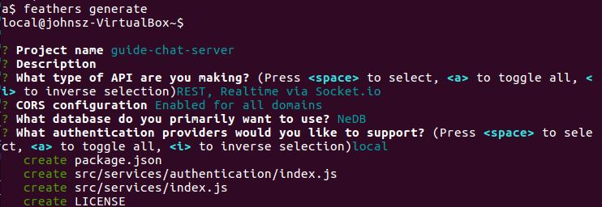
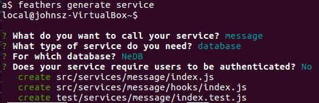
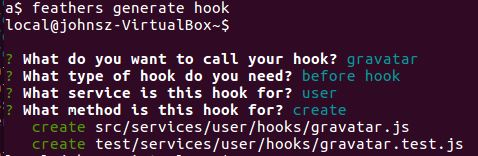

# Starting the server

The server needs authentication, which automatically creates `users`, and `messages`.
Let's handle the user avatar also.

## Working example

| Source code: https://github.com/eddyystop/feathers-an-introduction/tree/master/examples/chat/server/a

| Run it: `node ./examples/chat/server/a/src`

## Basic scaffolding

We generated the app with:
```text
mkdir examples/chat/server/a
cd examples/chat/server/a
a$ feathers generate
```


This generated the `authentication` and `users` services.
We then generated the `messages` service with:



We continued with generating a hook for handling the user avatar with:


## Clearing the database

Let's add code to clear the database each time this basic server is run.
This'll help prevent confusion should the server be started multiple times.

```javascript
// examples/chat/server/a/src/app.js
app.service('/users').remove(null)
  .then(() => console.log('users table cleared.'))
  .catch(err => console.log('ERROR clearing users table:', err));

app.service('/messages').remove(null)
  .then(() => console.log('messages table cleared.'))
  .catch(err => console.log('ERROR clearing messages table:', err));
```

- `service.remove(null)` deletes all of that service's items.

> **Remove.** You have to be careful not to accidentally pass `null`.
One way to protect yourself is by using a before hook that throws on `null`.

## Running the server

Start the server with `node ./examples/chat/server/a/src` and you will see:
```text
Feathers application started on localhost:3030
users table cleared.
messages table cleared.
```

Let's exercise the server with HTTP REST using these
[curl](http://www.slashroot.in/curl-command-tutorial-linux-example-usage)
commands:

```text
curl 'http://localhost:3030/users/' --data-binary '{ "email": "john@gmail.com", "password": "john123" }' -H 'Content-Type: application/json'
curl 'http://localhost:3030/messages/' --data-binary '{ "text": "Hello." }' -H 'Content-Type: application/json'
curl 'http://localhost:3030/messages/' --data-binary '{ "text": "Hello again!" }' -H 'Content-Type: application/json'
curl 'http://localhost:3030/messages/' --data-binary '{ "text": "Anyone there?" }' -H 'Content-Type: application/json'
```

Run them on another terminal with `./examples/chat/server/a/curl-requests.sh`
and the following is displayed:

```text
feathers-an-introduction$ ./examples/chat/server/a/curl-requests.sh
POST user john@gmail.com
{"email":"john@gmail.com","avatar":"https://s.gravatar.com/avatar/1f9d9a9efc2f523b2f09629444632b5c?s=60","_id":"WZl8x0bsbP5JW1Po"}
POST message Hello.
{"text":"Hello.","_id":"ObRdBmk5joooylTx"}
POST message Hello again!
{"text":"Hello again!","_id":"KZ2Kjp9nnGMta8zP"}
POST message Anyone there?
{"text":"Anyone there?","_id":"tcjSjPZQx8JoUCrz"}
```

The password is not displayed due to the users' after remove hook
